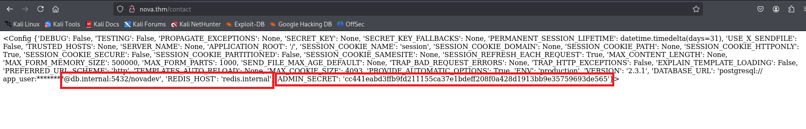

# Write-up: Chains of Love

## 1. Reconnaissance and Source Code Leak (Git Disclosure)

I started with an `nmap` scan, which revealed open ports 80 (HTTP) and 22 (SSH). To make things easier, I added an entry to the `/etc/hosts` file mapping the target IP (TARGET_MACHINE_IP) to the domain name `nova.thm`.


The main page didn't have a login panel or any interactive elements other than a contact form.


My first attempt was to check for an **SSTI** (Server-Side Template Injection) vulnerability using the `{{ 7*7 }}` payload. However, the form returned the same string without interpreting it, which initially ruled out a simple **SSTI** or **XSS** vulnerability there.


The next step was directory enumeration using the **gobuster** tool. This led to the discovery of a few important endpoints, including:

- `.git/HEAD`
    
- `/admin` (Status 302, redirecting to `/admin/login`)


The publicly accessible `.git` directory was a critical misconfiguration. I used the **git-dumper** tool to download the entire repository:

```Bash
python3 git-dumper/git_dumper.py http://nova.thm/ ./nova
```

 


Analyzing the downloaded repository revealed two key elements:

1. The existence of a `preview_feature.py` file with hidden logic – if a user submits a message containing `{{ config }}` in the contact form, the server will render the application's configuration object.


2. Commit author details: `daniel <daniel@thm.com>`, which provided a strong hint for a potential username.


---

## 2. Information Disclosure via SSTI

Exploiting the logic discovered in the code was straightforward. Sending a message with the content `{{ config }}` in the `/contact` form triggered the SSTI vulnerability, leading to the leakage of the Flask application's configuration object.

 



The most important leaked information was:

- **ADMIN_SECRET**: cc441eabd3ffb9fd211155ca37e1bdeff208f0a428d1913bb9e35759693de565
    
- **REDIS_HOST**: redis.internal

At the same time, analyzing the source code of the `/admin/login` page (discovered by `gobuster`) revealed a developer comment: `<!-- We recently moved to using JWTs -->`. Combining these facts – possessing the secret and knowing about the use of JWTs – pointed out the next attack vector.


---

## 3. Authentication Bypass (JWT Forgery)

Another `gobuster` enumeration, this time on the `/admin` path, uncovered a hidden `/admin/fetch` endpoint that returned an `Unauthorized` error. This suggested it was secured and made for a perfect target.

 


Despite having the secret, creating a valid token required figuring out a few parameters. To do this, I wrote a Python script that performed a brute-force attack, testing different combinations.


The attack was successful, revealing that the correct token had to meet the following conditions:

1. The signing key (`ADMIN_SECRET`) must be treated as a **String**, not bytes.
    
2. The user must be **daniel** (identified earlier in the Git logs).
    
3. The payload must contain the field `"role": "admin"`.
    
4. The token cookie must be named `token`.


After injecting the forged token into the browser, I gained access to the hidden `/admin/fetch` endpoint, which returned the message: `No URL provided`.


---

## 4. SSRF and "No-Digits" Filter Bypass

The `/admin/fetch` endpoint was vulnerable to **SSRF (Server-Side Request Forgery)**, allowing content to be fetched from a provided URL. However, I encountered a very restrictive filter:

`"Digits are not allowed, we really like DNS!"`


This block prevented the use of IP addresses and port numbers. The solution was to use the DNS hint and test hostnames without digits. Using the following address proved successful:

- **URL:** `http://internal.nova.thm`
    


---

## 5. RCE and Sandbox Escape (Error-Based Exfiltration)

An internal service was running at `http://internal.nova.thm`: **NovaDev Secure Python Sandbox**. It allowed executing Python code via the `code` GET parameter, opening the path to **RCE (Remote Code Execution)**.

However, the sandbox was heavily secured:

- **No visible output**: The "Output" field remained empty (likely due to network restrictions and how the proxy rendered the page).


- **Keyword blacklist**: `import`, `read`, and `__` were blocked.

 

 


- **"No-Digits" filter:** The payload still couldn't contain any digits.

### Strategy: Sandbox Escape and Data Exfiltration via Errors

Due to the lack of visible output, the only way to extract data was to force the Python interpreter to throw an error containing the flag in its message. The `int()` function was used for this, as it throws a `ValueError` when trying to convert text to a number.

### Bypassing Restrictions:

1. **No `read`**: I took advantage of the fact that a file object in Python is an iterator. The `next()` function fetches the first line of the file without using the forbidden `read` keyword.

2. **No `__` and `import`:** I abandoned trying to import the `os` module and focused on the built-in `open()` function.


### Final Payload:

Sending the following URL allowed me to read the flag:

`http://nova.thm/admin/fetch?url=http://internal.nova.thm/?code=int(next(open('flag.txt')))`


### Mechanism of Action:

1. The main server `nova.thm` let the URL through because it contained no digits.
    
2. Through the SSRF vulnerability, the request reached the internal Sandbox.
    
3. The Sandbox executed the `open('flag.txt')` code, opening the file with the flag.
    
4. The `next()` function fetched the first (and only) line of the file – which was the flag itself.
    
5. The `int()` function tried to convert the flag text into a number, resulting in an error.
    
6. The server returned the error message, which contained the flag: `ValueError: invalid literal for int() with base 10: 'THM{...}'`.
    


**Flag:** `THM{s4ndb0x_3sc4p3d_w1th_RCE_l1k3_4_pr0}`